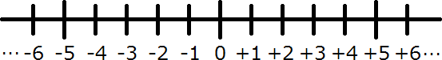

### 整数

ここで、数について一度整理しておきたいと思います。

まず、数には $-2,-1,0,1,2$ などの:rubyString[整数（せいすう）]と、 $1.1,1.2,1.3$ などの小数、 $\displaystyle \frac{1}{2},\frac{2}{5}$ などの分数があります。

それぞれにマイナスの数が入ってくるので数字の世界は倍に膨らんだことになります。

### 数直線

良く数字の世界を:rubyString[数直線（すうちょくせん）]と言うもので表しましが、これを使うと視覚的に数字の世界を理解できます。

そしてこの数直線の 0 より大きい部分を:rubyString[正の数（せいのかず）]、小さい部分を:rubyString[負の数（ふのかず）]といいます。

### 自然数

正の数の中で、整数の部分を:rubyString[正の整数（せいのせいすう）]、負の数の中で、整数部分を:rubyString[負の整数（ふのせいすう）]<といいます。
正の整数は別名があって、:rubyString[自然数（しぜんすう）]とも言います。（自然数には 0 は含まれません。）

一般に整数と言われるものには、正の整数、負の整数、0 が入っています。（0 は別格なのが注意です。）

当然小数や分数にも正の小数、負の分数という言い方があります。
