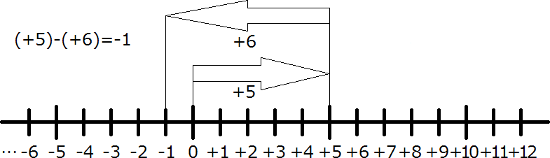

### 減法

引き算のことを:rubyString[減法（げんぽう）]といい、その答えのことを:rubyString[差（さ）]と呼びます。正の数同士の引き算は小学校でも習った通り、

$$
(+5)-(+3)=+2
$$

と計算できることは理解できると思います。でもこの引く数を $+3$ からどんどん大きくしていくとどうなるでしょうか。

### 減法の法則

$$
\begin{align*}
(+5)-(+3)&=&+2\\
(+5)-(+4)&=&+1\\
(+5)-(+5)&=&0\\
(+5)-(+6)&=&?
\end{align*}
$$

$+5$ を超えた時点で、小学校までの習ったことでは計算できなくなってしまいました。

ではどうすればいいのでしょうか。数直線を使って考えてみましょう。

https://player.vimeo.com/video/263120994?title=0&byline=0&portrait=0

上のようになります。つまり $(+5)-(+6)=-1$ ですね。

それでは、最後の形に注目してください。

この形は足し算の $(+5)+(-6)=-1$ と同じ図になっています。

つまり、 $(+5)-(+6)=-1$ と $(+5)+(-6)=-1$ は同じ答えになるのです。

では違うところはどこでしょう。それは、減法が加法に変わって、後ろの数字の符号がプラスからマイナスになっています。

### 減法の計算の仕方

実は、減法は加法に変えることができ、そのために、後ろの数字の符号を逆にします。

$$
(+5)-(+6)=(+5)+(-6)=-1
$$

こう考えると、すべての減法を加法に変えることで、加法の計算として解くことができます。
