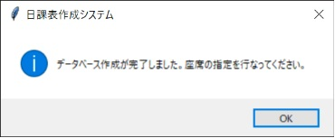

このソフト群は日々教師が行っている生徒の授業態度の記録をできるだけ簡単に入力、集計ができるようにと開発を行いました。具体的には、日々の生徒の状況（欠席や授業態度のこと）を授業中その場で入力していくことで、学期末の集計が簡単にできるようになっています。また、クラスの座席表にも対応し、座席表が変更になった場合でも簡単に変えることができるようになっています。

## 1 ダウンロードおよびインストール

### 1.1 ダウンロード

Vector のサイトhttp://www.vector.co.jp/soft/winnt/business/se515819.html よりダウンロードできます。

1.3.2 インストールとアンインストールについて

インストールは zip ファイルを解凍してください。アンインストールはソフトのフォルダーごと削除するとすべて削除できます。レジストリは汚していません。

## 2 使用方法

### 2.1 新規作成

1. 日課表作成システムをダブルクリックして起動します。  
     
   nikkahyo.exe

1. 初期画面です。初めに新規作成を行います。新規作成をクリックします。  
   

1. 学年とクラス数、データーベース名、不正行為を入力します。  
   学年は 6 年まで対応、クラスは 8 クラスまで、不正行為は改行で区切ります。  
   

1. 作成ボタンを押すと「名列データを編集します。編集が終わったら必ず保存してください。」と出るので、OK をクリックする。  
   

1. しばらくすると名前入力のためにエクセルが立ち上がります。そこに名前とふりがなを入力してください。（1 行目を削除しないでください。）  
   （エクセルがインストールされていないときは、メモ帳で、data フォルダーにある name.csv ファイルを開いて、名前とふりがなを入力する。）  
   

1. 名簿の作成が終われば、データーベースを作成します。実行をクリックしてください。  
   

1. これでデーターベースの新規作成が終了しました。  
   

### 2.2 座席指定

1. 次は座席指定を行ないます。座席指定をクリックしてください。  
   

1. まずは左下にあるクラスを選択します。  
   

1. その後座席の位置に出席番号を入力します。  
   

1. 入力が終了すると更新ボタンを押します。

1. 入力確認画面が出るので、間違えなければ更新ボタンを押します。  
   

1. これで座席指定が終了です。

### 2.3 クラス入力

1. ここまで来れば授業中に使うことができます。授業開始時にクラス入力をクリックしてください。  
   

1. 使いたいクラスを選んで、授業時間を選択します。  
   

1. クラスを選択すると前時の授業内容が右に表示されます。良ければ実行をクリックしてください。（日付を変更したければ、日付変更ボタンをクリックして日付を変更してください。）  
   

1. 授業中の入力画面です。  
   

1. 名前をクリックすると不正行為を入力できます。  
   

1. 目的の不正行為をクリックし、OK ポタンを押すと入力できます。

1. 間違えて入力したときは、削除ボタンを押します。  
   

1. 上のダイアログが出るので、間違えた ID を入力して実行をクリックしてください。削除されます。

1. 授業終了時は授業終了ボタンを押してください。  
   

1. 上のダイアログが出るので、次回へのメモを残してください。（宿題や、どこまでやったかなど）入力が終わると、終了を押してください。クラス入力が終了します。

### 2.4 書き出し

1. 学期末になって成績を付けるときに書き出しを行ないます。書き出しをクリックしてください。  
   

1. 集計したい始めの月日を上の段に、終わりを下の段に入力します。  
   

1. それぞれの日付変更をクリックして、設定したい日付をクリックしてください。  
   

1. 良ければ、実行をクリックすると名前を付けて保存ダイアログが表示されます。  
   

1. 名前を付けて保存してください。初期設定だと、ソフトと同じ場所に保存したファイルが作成されています。エクセルファイルなので、自由に変更してください。

## 3 よくある質問

1. エクセルがインストールされていません。このソフトは使えないでしょうか。  
   → ソフト自体はエクセルが入ってなくても使用できます。書き出した後のファイルを編集するときにエクセルが必要になます。

1. エクセルがインストールされていません。名前入力の「name.csv」をどう編集したらいいですか。  
   →1 行に「学年, クラス, 番号, 名前, ふりがな」の順にコンマ区切りで保存してください。

1. 名前入力のためにエクセルで編集しようとすると「データ損失の可能性　このブックをコンマ区切り（.csv）形式で保存すると、一部の機能が失われる可能性があります。機能が失われない様にするためには、Excel ファイル形式で保存してください。」とでます。どうしたらいいですか。  
   →csv ファイル形式を使用しています。そのまま、上書き保存してください。

1. データーベースを新規作成する前にダイヤログを終了してしまいました。どうしたらいいですか。  
   → もう一度、新規作成から始めてください。

1. 書き出しをした後のファイルをエクセルで編集しようとすると「データ損失の可能性　このブックをコンマ区切り（.csv）形式で保存すると、一部の機能が失われる可能性があります。機能が失われない様にするためには、Excel ファイル形式で保存してください。」とでます。どうしたらいいですか。  
   → そのままでは、数式などの保存ができません。「名前を付けて保存」で、「ファイルの種類」を「Excel ブック」形式で保存し直してください。

## 4 著作権

- ファイル名:nikkahyo.exe
- Version:1.3.0
- 著作者:山原　喜寛（Yamahara Yoshihiro）
- 著作年:2017-2020
- HP:https://www.hobofoto.work/
- E-mail:yoshihiro@yamahara.email
- ライセンス:フリーソフト

この日課表作成システムはフリーソフトになっております。どなたでも自由に使用していただくことができます。ただし、著作権については山原喜寛が保持いたします。  
このソフトを使用してのいかなる問題が生じた場合も、著作者はその責任を負いません。バージョンアップや不具合に対する対応の責任も負わないものとします。ご了承ください。

## 5 終わりに

学校の先生は日々業務に追われていると思う。授業研究から保護者対応、テストの採点、書類の作成･･･ それが仕事だと一言で片付けてしまっては、身も蓋もないが大変な業務だと思う。  
それでも、先生という職業は人を育て、その人が未来を作っていくと思うと、とても素晴らしい職業だと思う。  
そんな先生の業務が少しでも楽になるようにと模索した結果、このソフトの開発に行き着いた。  
このソフトでは日々の授業記録が簡単にでき、その集計も一瞬にして完了する。少しでも役に立ってくれれば幸いだ。

先生たちの日々の努力に感謝して。

山原　喜寛
